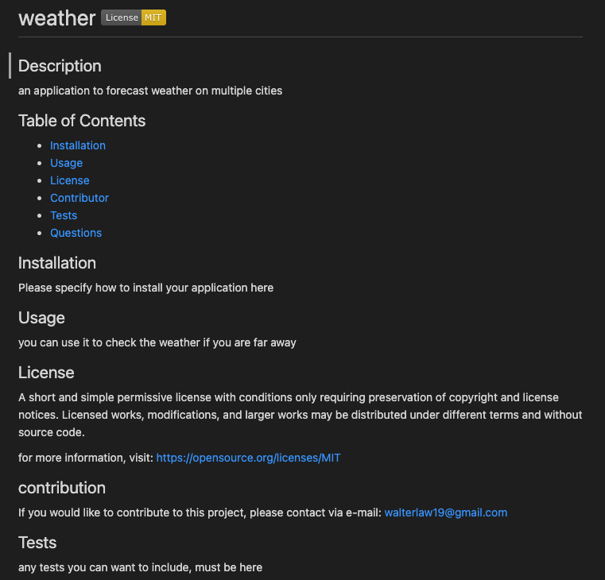
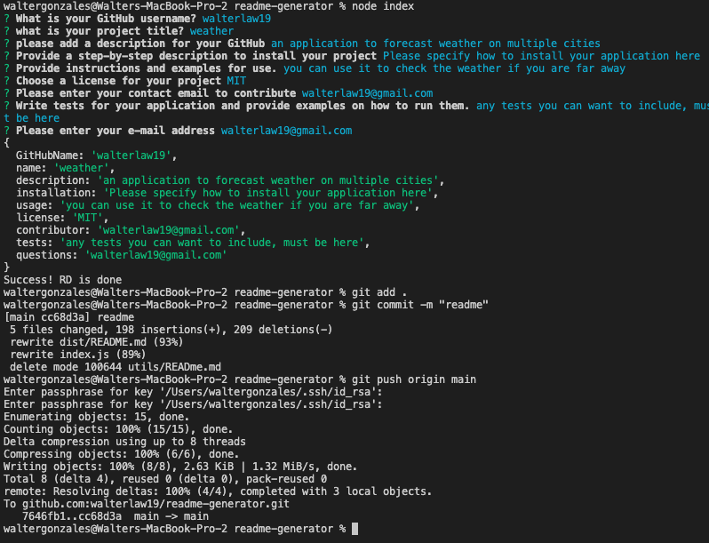

# Readme Generator

## Description
The Weather Application using weather API provides you the current weather, date, wind and UV index more so you can go out safe knowing if the conditions are favorable. Also, it renders a 5 day forecast of the city you are vacationing so you can plan ahead. The search history allows you to see the cities you already viewed and allows you to view them again. This powerful application is brought to you by openweathermap.com and also uses:

## Table of Contents

[]
[](https://opensource.org/licenses/MIT)


* HTML
* CSS
* Javascript
* DOM
* JQuery
* BootStraps
* Moment.js


* [testing](#usage)


## Installation

https://walterlaw19.github.io/weather-dashboard/

## Usage

 "Screenshot1"
 "Screenshot2"
 "Screenshot3"


## License


## contribution


## Tests

## Questions


```
Made by by Walter G
```

---
##### © 2021 WG.


GIVEN a command-line application that accepts user input

<!-- WHEN I am prompted for information about my application repository
THEN a high-quality, professional README.md is generated with the title of my project and sections entitled Description, Table of Contents, Installation, Usage, License, Contributing, Tests, and Questions -->

<!-- WHEN I enter my project title
THEN this is displayed as the title of the README -->

<!-- WHEN I enter a description, installation instructions, usage information, contribution guidelines, and test instructions
THEN this information is added to the sections of the README entitled Description, Installation, Usage, Contributing, and Tests -->

WHEN I choose a license for my application from a list of options
THEN a badge for that license is added near the top of the README and a notice is added to the section of the README entitled License that explains which license the application is covered under

<!-- WHEN I enter my GitHub username
THEN this is added to the section of the README entitled Questions, with a link to my GitHub profile -->

<!-- WHEN I enter my email address
THEN this is added to the section of the README entitled Questions, with instructions on how to reach me with additional questions -->

<!-- WHEN I click on the links in the Table of Contents
THEN I am taken to the corresponding section of the README -->